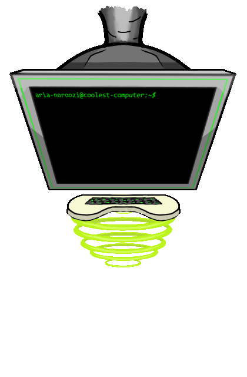
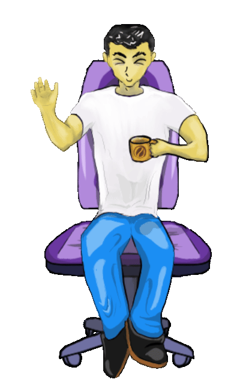

This website marks my first fully hands-on experience with frontend development. Taking the reins to do whatever I want stylistically made for an enriching experience putting all the pieces together.

## Not a frontend fiend

Anyone whose spoken with me in person has heard at least one earing from me about how frontend has never been my bread and butter, and how I've much more preferred being the lil hero behind the screen making all the stuff you see work. But I knew the day would come one day where I'd have to benefit from making my own website! Strengthen my frontend skills, and understand Javascript more comprehensively, you know?

I'm fortunate for **Astro** being quite a simple (and not to mention fast) solution to the hurdle of frontend I've let grow bigger and bigger. Astro is the framework I've used to make this website, great for static sites that don't depend on storing any data (you sleep easy tonight, I don't want anything from you hahah) so it became clear to me that all I really needed to think about was including all the bare essentials and, once that was over with, **get creative with my design!**

## The artsy me

**All of the front page animations were made by yours truly.** I figured that incorporated digitally drawn screen elements I made and slapping them onto the frontend would be a nice roundabout way of making me understand frontend and all of its quirks with positioning and styles better. Not only has it done that, but it has made coding this website all the more fun. Each animation you see on the frontpage took around 1-2 hours to make, and positioning them was not as hard as I thought it would be. Overall, incorporating hand-drawn elements into frontend is a great way to show yourself while also have fun making websites. Really that's the M.O I want to run with these days! **Have fun making cool stuff.**

I've learnt a lot on the scripting front while making this website, too. The projects page you're reading this on has a script itself, besides the tag filtering functionality the blog page has too. Have you played around with the descriptions much yet? It was a great realisation using an interval and string slices to give the revealing effect when hovering over the post.

Another thing! Have you seen the last.fm widget on the front page of the website? Pay close attention to when my last.fm is active or dormant. Ever notice how record stops spinning when I'm offline?

Very happy I made this. I'm excited to expand on the website more in the future!

