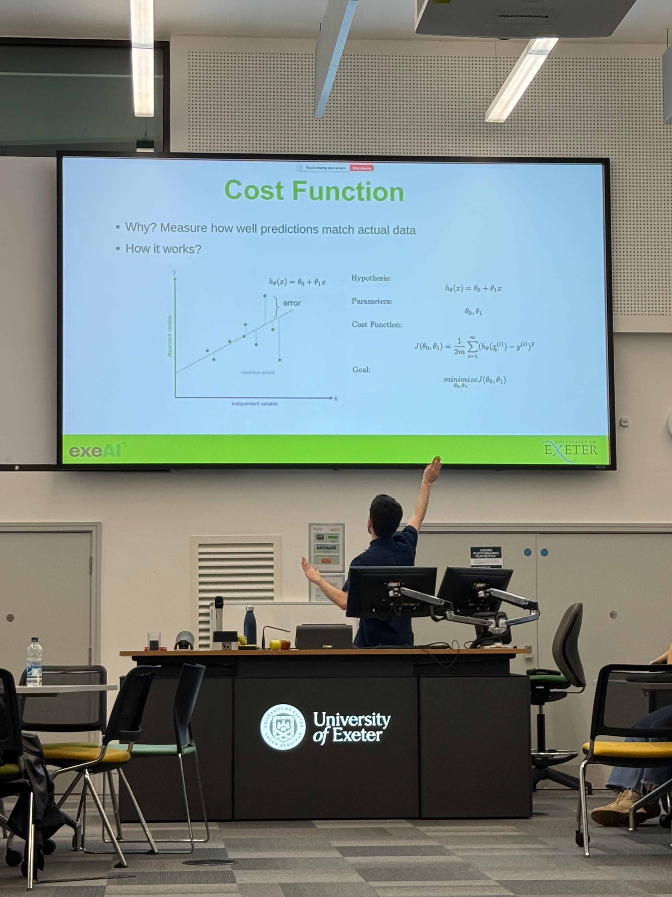
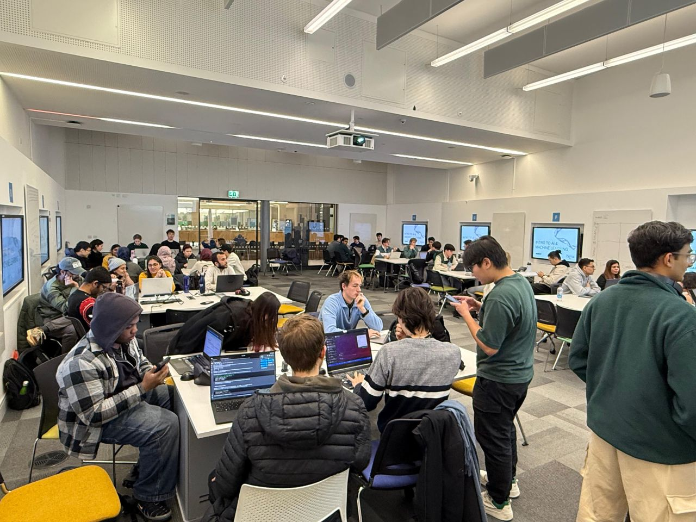
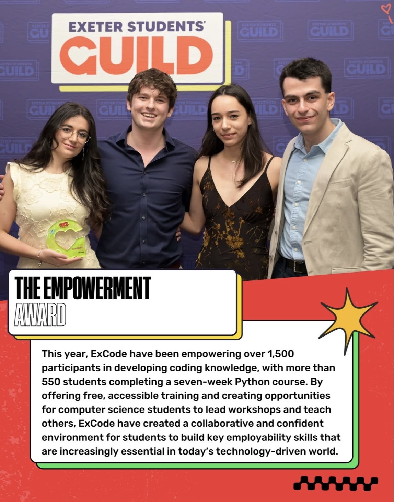
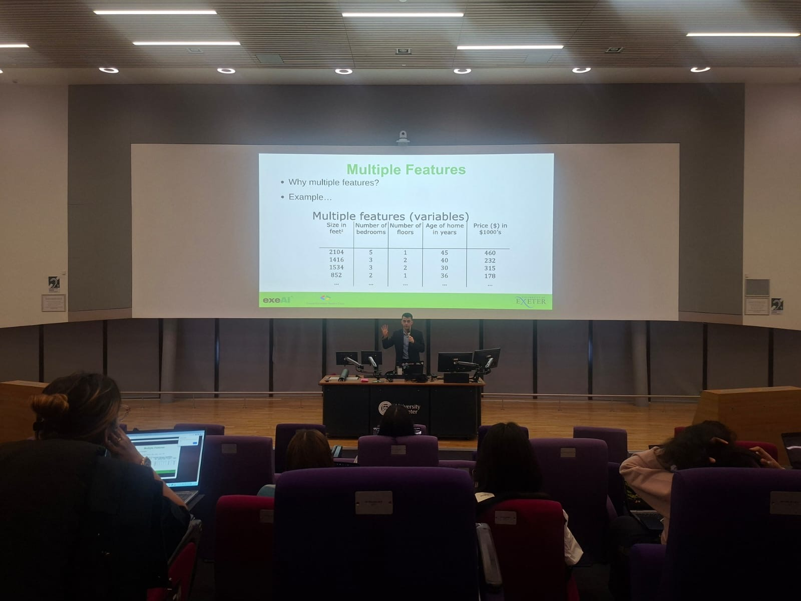

## What is ExeAI?

ExeAI is a machine learning fundamentals course I **co-founded and lectured for** in 2025 & 2026 at the University of Exeter. As I've graduated and am passing on the torch to the new team, I won't be continuing my duties there, but they've got my contact just in case!

ExeAI also has a lil hackathon at the end of the lessons; I co-hosted the hackathon both years.

**I taught 150+ students in 2025,** receiving 4.5/5 in student reviews. I also taught a lesson in 2026 to 80 students.

**In 2026, we won the student guild empowerment award!** It was an unforgettable experience. To think having this outreach you adore, getting to interact with so many people in such a profound capacity, is worthy of being awarded is one many reasons I do this for the love of the game!

## The Story (2024-25)

Picture me 2 years ago from the time of me writing this (sooooo 2024): A lad chilling on his summer holiday with the family in Barcelona. Mimosas readily available in the breakfast buffet, and my foodie soul blessed by bakeries-a-plenty across the streets.

When all of a sudden, I get a message from my good buddy, asking about starting up a machine learning course at our university! I just had to yes from the jump. His reason I came to mind to be the course's lecturer was hilarious by the way, **saying I have a propensity to "yap".** He knows me too well, perhaps it was as I partnered with him in a hackathon the year prior, and led the presentation.

The name ExeML gets thrown around (get it? Cause uni of exeter, and xml is a file extension, AND ML is machine lear- okay you do...), before eventually becoming ExeAI!

No! Not that ExeAI, please :)

It would go on to run the second term of that incoming year. I was in second year at the time: January & February 2025. I had myself thinking I should prep a script, really home in on what makes a good teacher. But alas, I was again a second year. Not the teaching type! Or so I thought. **I scrapped the script idea,** the first three slides would've taken 15 minutes! All I had on hand to use each session was 45.

Sooooo yeah scripts were a no-go; I instead wrote down short notes per slide that I'd keep with me during each actual lecture. The rest came down to my good friend improvisation! God when I tell you I was nervous about teaching for the first time, believe it! Voice shaky, arms shaky, the works. But as the weeks would go on, I found a wicked groove, and it swelled my heart seeing so many people who'd come in each week telling me they learnt so much in my lessons about machine learning. **My favourite part was getting to sit and chat with the students I taught,** not just about the course, but our lives. They were my peers and friends after all! It was the kind of high information, low pressure environment I was pushing for it to be, and **I'm glad ExeAI received the warm reception it did.**

## The Return (2026)

And not one I was fully expecting to make! I did not know if I'd be in Exeter 2025-26 on account of my placement hunt. But alas, it was a failed hunt :(

I had been super preoccupied with the massive effort spike all students experience going into third year, and my time **managing workshop rooms for ExCode** in first term (ExCode being the programming-focused subsidiary of ExeAI I had a lesser hand in), till before I knew it, ExeAI was in season again. They had asked me if I wanted to teach again, to which **my response was an instantaneous yes!!!** Albeit for only one lesson this time around, but man the vibes were so different. Maybe it was the bevy of courseworks and my diss keeping me up that **made me such a cool cucumber this session,** or maybe it's because I just knew the whole song and dance at this point, but it was a farcry from my deer-in-headlights moment at ExeAI 2025 hahaha. I was cracking jokes, walking across the whole auditorium, charismatic as ever. The anxiety had rolled off the map! **I even got the audience to do a wave as I ran past them for goodness sake** (probably for the best that this session wasn't recorded haha). It was also so nice a good friend of mine attended that lesson, as well as another one I leant a hand in.

The link below leads to my 2025 sessions, which made up the entire course that year. I hope you enjoy giving it a gander hehe.  
