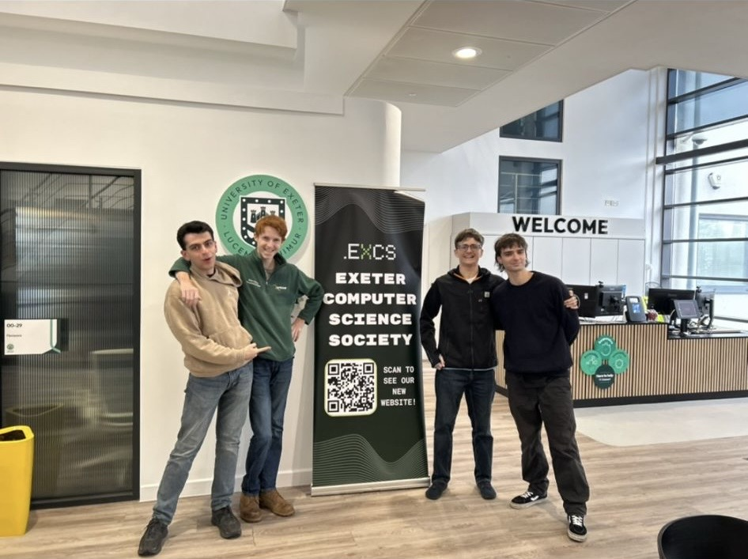
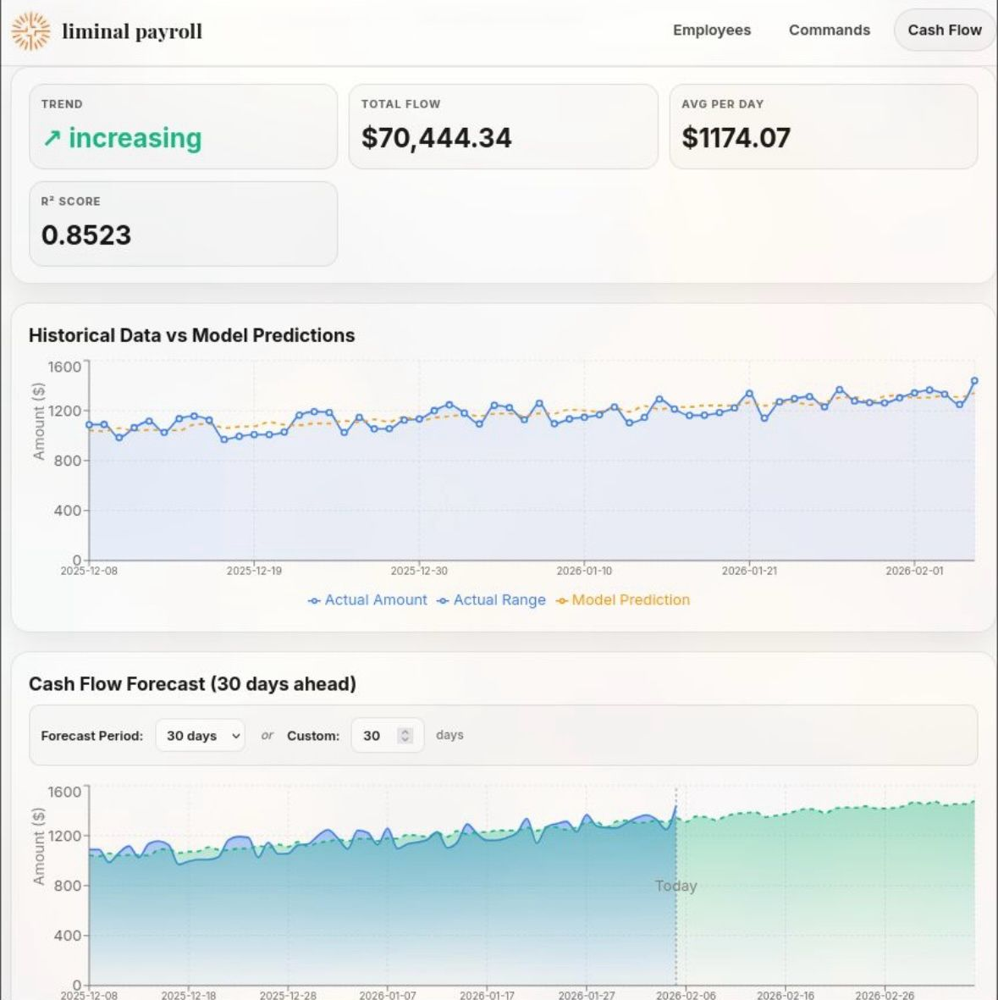

## What is Liminal Payroll?

Written in Golang, Liminal Payroll is a web application that **automates the management of employees, company payroll, and cashflow**: the in-going and outgoing expenses the company faces

This project came together through me and 3 of my friends entering Hacksouthwest: a hackathon event based in, you guessed it, South West England. Winning second place, the obligatory hackathon pizza and energy drinks were all completely necessary in securing us the win.

It was fun bantering with the others on what to concoct those first few hours. When we settled into our roles though, it was nothing but an all-out lock-in sesh till the very end.

This meant that sleep became a very foreign concept to me! The 1 hour I got felt heavenly though.

## My Role

I was the AI guy of my group. My task was to handle **the charting of cashflow** in and out of the given company.

My immediate thought was to expand on the functionality and potential we were working with: What if we could not only chart the existing trends cashflow was making, but also **project the future of cashflow** based on prior data?

My mind was immediately drawn to making a lightweight regression model, using PyTorch for model construction and training, and onnx-go: a library supporting the capability to import a pre-trained neural network into a Golang script. After seriously testing the waters, the process of testing and transferring a network did not prove as fruitful as I'd hoped (wish I found that conclusion sooner).

It wasn't until the crack of 7am when the realisation hit me: that cashflow charting could instead rely on a closed-form solution! I mean it made sense, for something as scattershot as the day to day, how much information would a fully-fledged non-linear model pick up and meaningfully use?

And so, I implemented an **Ordinary Least Squares (OLS) Regression model in closed form**. OLS Regression is ideallic for day-to-day data for as their coefficients are easy to interpret by users: up/down = good/bad. Sure, you could argue the assumption of each payment in and out of the company becoming independent of one another is not completely grounded in reality, but for hackathon, the maths was looking sick and more importantly, that it was looking like a last-minute breakthrough.

### Closed-form OLS Solution

Given a linear model:

$$
\mathbf{y} = \mathbf{X}\boldsymbol{\beta} + \boldsymbol{\varepsilon}
$$

The Ordinary Least Squares estimate is:

$$
\hat{\boldsymbol{\beta}} = (\mathbf{X}^\top \mathbf{X})^{-1} \mathbf{X}^\top \mathbf{y}
$$

This maths could be **programmed in native Golang**, making it the fastest option computationally! The application forms an OLS regression across the span of 30 days (symbolic of a month), as far back as the user selects. Upon weighting each regression's gradient depending on its distance from current day, it would affect the ensuing linear regression that projects future cashflow!

My teammates hard work in conjunction with my breakthrough earnt us **2nd place**, along with 100 of the host company's smart coin! I enjoyed this project greatly, and I'm eager to get back into the crazy art of breakthroughs at hackathons, fuelled by pizza, once again.

