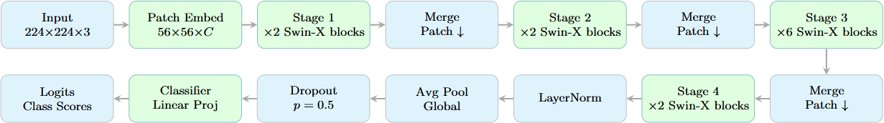
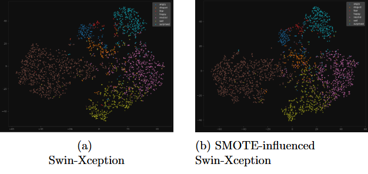
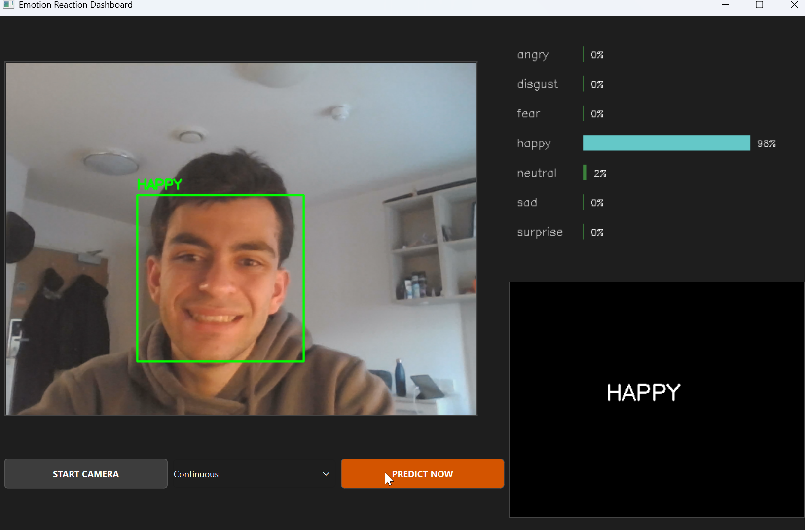

## What is Swin-Xception?

With the aim of drawing closer significance to local, fine-grained features while remaining light on parameters, I developed Swin-Xception. This is a Swin Transformer architecture trained in PyTorch that **replaces the Multi-Layered Perceptron Feedforward Network at the end of each swin block with a depthwise separable FFN,** introducing an inductive bias.

Swin-Xception also makes use of a **SMOTE-retraining phase.** Motivated by the class imbalance that frequents in=the-wild facial expression recognition datasets, I trained the model on the base RAF-DB dataset, then extracted deep features from the newly trained frozen model. Features on the latent space were then utilised to synthetise new features, creating a uniform distribution every expression type. This proved to heighten per-class accuracy, especially in the case of minority classes of "fear" and "anger"; these two expressions in particular would gain their own cluster in the t-SNE graph upon SMOTE retraining, emphasising the importance of implementing class rebalancing without overfitting.

The experiment also featured **Grad-CAM** for explainability; I aimed to see if hotter ROIs correlated with **Paul Ekman's Facial Action Coding System (1978).** I also introduced a real-time test in which I used my laptop camera to classify my facial expressions in real time, presented on a PyQt interface.

## What I learned

The readme on the repo page does a better job explaining the model than this project bio will. So I figured I'd use this page to air out the limitations this project faced, and what could be next in a development on Swin-Xception.

### The results

The greatest roadblock between this project and publishing were the results in relation to current state-of-the-art models. Swin-Xception had approximately 36M params and a **Weighted Average Recall of 81.13%,** very good overall. The problem came in the form of my choice of comparator models:

- ResNet50 pretrained came up to 80.38%
- And (the real game-ender) Swin-Small pretrained reached over 85%

Swin-Xception used all of the same block/embedding counts as Swin-Tiny, but the DS-FFN gave it many more parameters; it cut the middle-man between Swin-Tiny and Small. But for the 12M more parameters it added over Tiny, **the benefits felt negligible.** Perhaps I could have **used more fair comparisons instead of Swin-Small,** which had 12 more swin blocks than my Swin-Xception.

WAR would drop marginally upon SMOTE retraining, but the **massive boost to UAR** more than made up for it.

Another fault came at the hands of the holdout dataset, FER2013. **The domains are simply too different;** where the depthwise component focuses on each channel individually, the greyscale images of FER2013 do nothing with regard to the DS-FFN. Accuracies for all models danced around the 45-50% range, displaying competency in solely the happy and neutral class predictions.

### Hardware

The entire of model training was conducted via my gaming laptop, which was exciting to say the least! I've only used this bad boy for proper gaming like 2 times, the rest has been AI training hahaha. It was super cool seeing **CUDA** in action and the tqdm progress bar speedrun through each epoch, but that same excitement of using my own hardware became a limitation in its own right. It would run **Swin-Tiny** parameter counts fast, not doing well with anything much higher. On a second go around with making Swin-Xception, I'll have to decide what matters more to me: keeping it lightweight, or bumping up the performance to state-of-the-art levels of proficiency.

### The placement of the Xception component

The Xception component made up the feed forward network of each block, but it very well could be **placed in a different component of the transformer.** Thing is, it's a convolutional method in conjunction with MSA; they compute attention very differently. Maybe I could employ the principle of an expansion ratio somewhere in the MSA calculation.

### Explainability and real-time validation

Grad-CAM displayed competency in drawing ROIs on Action Units that would indicate the emotion they're classified under, which **proved well for explainability.** The same cannot be said for non-standardised, real-time face captures. **We all emote differently.** That's not a computer vision principle or something FACS is predicated on, that's just a natural component of us as humans. Sure it would compose heatmaps, but the amount of insight they'd produce was questionable to say the least; when I smile at the camera, is that truly the happiness indicator? FER2013 and RAF-DB are reliable datasets as they feature group annotations and consensus over each image as to what expression they belong to.

It was interesting, not to mention cool as hell to see my facial expressions get classified but, even with the widened classification boundaries produced by the SMOTE phase, happiness, neutrality and sadness were the only 3 expressions to see a truly accurate response.

## What I'd do differently next time

Next time, I would:

- Experiment with the positioning of the Xception component
- Use more apt comparison models
- Experiment on even stronger hardware
- Introduced standardised real-time experimentation

But for my time training a proper computer vision model? 81% ain't too shabby if I say so myself. Catch me levelling up Swin-Xception in the future!
